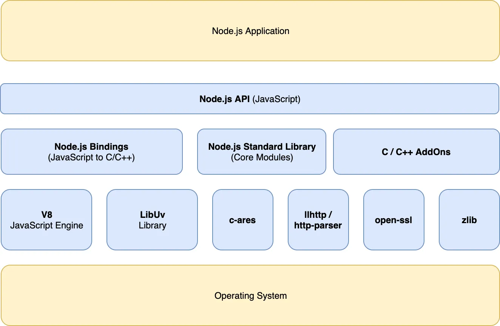

## 질문 리스트

<details>
<summary>Q1. 동기/비동기, 블로킹/논 블로킹 방식에 대해 설명하시오</summary>
</br>
동기와 블로킹. 비동기와 논 블로킹은 유사한 개념으로 느껴지지만, 관점의 차이가 있다.
동기/비동기는 순차적인 작업을 보장할 것인지, 결과를 기다리는 주체가 누구인가에 대한 관점이고, 블로킹/논-블로킹은 현재 작업이 멈추게 되는가에 대한 관점이다.

`동기/비동기`

- 순차적인 작업을 보장할 것인지에 대한 관점
- 요청하는 측에서 작업 완료 여부를 체크하는 방식에 따라 동기/비동기가 나뉨
- `비동기`
  - Caller가 Callee의 작업 완료 여부를 신경쓰지 않음
  - Callee의 작업은 별도의 Thread로 빼서 실행하며 완료되면 호출한 함수에게 알려줌
- `동기`
  - Caller가 Callee의 작업 완료를 기다림 (블로킹)
  - Caller가 Callee의 작업 완료를 주기적으로 물어봄 (논-블로킹)

`블로킹/논-블로킹`

- Caller의 현재 작업이 멈추게 되는가에 대한 관점
- `블로킹`
  - Callee가 바로 리턴하여, 제어권을 바로 Caller에게 돌려줌
- `논-블로킹`
  - Callee가 자신의 작업을 완료할 때 까지 리턴하지 않음
  - Callee가 작업을 하는 동안, Caller의 작업은 멈춤

`REF`

- https://steady-coding.tistory.com/5313333

</details>

<details>
<summary>Q2. Node JS는 논-블로킹, 비동기 I/O 단일 쓰레드 이벤트 루프 기반으로 동작하는데 이에 대해 설명하시오.</summary>
</br>

Node.js는 작업을 백그라운드 쓰레드(또는 OS의 작업 처리 메커니즘)에 위임하고, 해당 작업이 완료될 때까지 기다리지 않고 다른 작업을 계속 처리한다.

`Node JS의 특징`

1. Single Thread (Main Thread)
2. Non Blocking I/O

   

`libuv`

비동기 I/O를 지원하는 C언어 Libray로, 커널의 비동기 API를 사용할 수 없는 작업을 비동기화 하기 위해 별도의 Thead Pool을 가지고, Evnet Loop와 Event Queue를 관리한다.


- `Thread Pool`

  libuv는 전달된 비동기 요청을 커널에게 전달하는데, 이때 커널이 처리할 수 없는 작업이면 libuv가 Thread Pool에 있는 Thread에게 작업을 할당함

  > NodeJS는 I/O 작업을 메인 쓰레드가 아닌 백그라운드 쓰레드에 위임함으로써, 싱글 쓰레드로 Non-Blocking I/O를 지원.

- `Event Loop`

  - 이벤트 루프는 Node.js가 여러 비동기 작업을 관리하기 위한 구현체.
  - Event Loop는 Main Thread안에서 실행되며 비동기 callback 작업이 수행될 수 있도록 도와줌.

- `비동기 콜백 과정`
  1. 요청이 들어오면 Event Loop가 해당 요청이 Blocking I/O인지 아닌지 판별한다.
     1. **커널의 비동기 I/O로 처리 가능한 경우 (Non Blocking I/O)**
        - 커널의 interface로 해당 요청을 처리 한 후Event Queue에 callback에 등록
        - 커널이 작업하는 동안 사용되는 쓰레드는, Node JS가 생성한 쓰레드가 아닌, 운영 체제 자체의 쓰레드이다.
     2. **커널의 비동기 I/O로 처리 불가능한 경우 (Blocking I/O → Non Blocking I/O)**
        - 커널의 비동기 I/O로 Blocking I/O를 libuv를 활용하여 Non Blocking I/O로 처리
          - libuv 내의 별도의 Thread Pool에서 Worker Thread를 선택하여 작업을 위임
          - Worker Thread는 작업을 완료한 후 Event Queue로 callback을 등록
  2. Event Loop는 주기적으로 call stack이 비어있는지 체크하고 Event Queue에 실행 대기중인 callback이 있다면 callback들을 call stack으로 이동시켜 Main Thread에 의해 실행될 수 있게 만들어줍니다.
- `etc`
  - Event Loop는 6개의 단계로 이루어져 있으며 각 단계별로 Event Queue를 소유
  - Event Loop는 각 단계를 순차적으로 순회하며 반복적으로 callback들을 처리

`REF`

- https://www.korecmblog.com/blog/node-js-event-loop
- https://medium.com/zigbang/nodejs-event-loop파헤치기-16e9290f2b30

</details>

<details>
<summary>Q3. 컴파일러 언어와 인타프리터 언어는 어떤 차이를 가지고 있는가</summary>
<br/>

`컴파일러 언어`

> 코드를 한 번에 기계어로 번역하는 컴파일 과정을 거친 뒤, 생성된 실행 파일을 실행하는 방식

- 장점: 실행 속도가 빠르고, 프로그램이 배포 시 독립적(컴파일된 실행 파일만 제공).
- 단점: 컴파일 과정이 필요하며, 코드 수정 시 다시 컴파일해야 함.

`인터프리터 언어`

> 코드를 한 줄씩 번역하여 바로 실행하는 방식으로, 인터프리터가 코드를 읽고 바이트코드로 변환한 뒤 실행

- 장점: 코드를 바로 실행할 수 있어 디버깅과 테스트가 편리함.
- 단점: 실행 속도가 느릴 수 있고, 배포 시 소스 코드가 포함될 수 있음.

</details>

## 04장

### 4.3 변수 선언

**변수 이름은 어디에 등록되는가 ?**

- 변수 이름을 포함한 모든 식별자는, `실행 컨텍스트`에 등록됨
- 변수 이름과 변수 값은 컨텍스트 내에 키/값 형식으로 등록되어 관리됨

**var 키워드**

- var 키워드는 변수 선언과 초기화 단계가 동시에 진행됨.
  - `undefined`로 초기화 되어, 해당 메모리에 들어있던 쓰레기 값을 걱정할 필요없음

### 4.4 변수 선언의 실행 시점과 변수 호이스팅

**변수호이스팅**

`what`

- 변수 선언문이 코드의 선두로 끌어 올려진 것처럼 동작하는 자바스크립트의 고유한 특징

  - score 선언전에 score의 값을 참조하고 있으므로, 참조에러가 발생할 것 같지만 undefined가 출력됨

  ```javascript
  console.log(score); // undefined
  var score;
  ```

`why`

- 자바스크립트 엔진이, 소스코드를 평가하는 과정에서 모든 선언문을 소스코드에서 찾아내 먼저 찾아내 실행하기 때문.
- 즉, 변수 선언이 런타임 런타임이 아니라, 그 이전 단계에서 실행되기 때문

`conclusion`

- 변수 선언이 소스코드의 어디에 위치하는지와 상관없이 어디서든 변수를 참조할 수 있게됨.
- **변수 선언뿐 아니라 var, let, const, function, function\*, class 키워드를 사용해서 선언하는 모든 식별자는 호이스팅됨**

### 4.5 값의 할당

- 변수 선언과 값의 할당의 실행 시점이 다르다.

  ```javascript
  console.log(score); // undefined

  var score;
  score = 80;

  console.log(score); // 80
  ```

  `why`

  - 변수 선언은 런타임 이전에 먼저 실행되지만, 값의 할당은 소스코드가 순차적으로 실행되는 런타임 시점에 실행되기 때문.

- 변수 선언과 값의 할당을 하나의 문으로 작성해도, 선언과 할당의 실행 시점은 다르다.

  ```javascript
  console.log(score); // undefined

  var score = 80;

  console.log(score); // 80
  ```

  `why`

  - 변수의 선언과 값의 할당을 하나의 문장으로 단축 표현해도, 자바스크립트 엔진은 변수의 선언과 값의 할당을 2개의 문으로 나누어 각각 실행하기 때문.

- `undefiend`가 할당된 메모리에 80이라는 값을 덮어 씌우는 것이 아니라, score에 새로운 메모리 공간을 할당하고, 새로운 공간에 값을 할당한다.

## 05장

### 5.1 값

- 값은 표현식이 평가되어 생성된 결과

### 5.2 리터럴

- 리터럴은 사람이 이해할 수 있는 문자 또는 약속된 기호를 사용해 값을 생성하는 표기법
- 자바스크립트 엔진은 런타임에 리터럴을 평가해 값을 생성한다.
  

### 5.3 표현식

- 표현식은 값으로 평가될 수 있는 문이다. 표현식이 평가되면 새로운 값을 생성학서나 기존 값을 참조한다.
- 리터럴도 값으로 평가되므로, **리터럴도 표현식이다.**
- 식별자 참조는 값을 생성하지 않지만, 값으로 평가되므로 표현식이다.
  ```javascript
  score; // 식별자 참조
  ```

### 5.4 문 (Statement)

- 문은 프로그램을 구성하는 기본 단위이자 최소 실행 단위이다.
- 문은 여러 토큰으로 구성되며, 토큰은 문법적으로 더 이상 나눌 수 없는 코드의 기본 요소를 의미한다.
  - ex) 키워드, 식별자, 연산자, 리터럴, 세미콜론, 마침표 등의 특수기호
  - 

### 5.5 세미콜론

- 세미콜론(;)은 문의 종료를 의미한다.
  - 자바 스크립트 엔진은 세미콜론으로 문이 종료한 위치를 파악하고 순차적으로 하나씩 문을 실행한다.
  - 단, 0개 이상의 문을 괄호로 묶은 코드 블록 ({..})뒤에는 세미콜론을 붙이지 않는다.
    - ex) if문, for문, 함수 등의 코드 블록뒤에는 세미콜론을 붙이지 않음

### 5.6 표현식인 문과 표현식이 아닌 문

- 표현식인 문과 표현식이 아닌 문을 구별하는 가장 간단하고 명료한 방법은 변수에 할당해 보는 것.
  - 표현식인 문은 값과 동치이므로, 변수에 할당할 수 있음.
    - 표현식인 문 -> 값 할당 O
    - 표현식인 아닌 문 -> 값 할당 X
