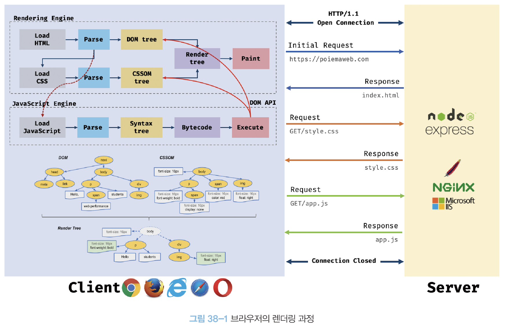
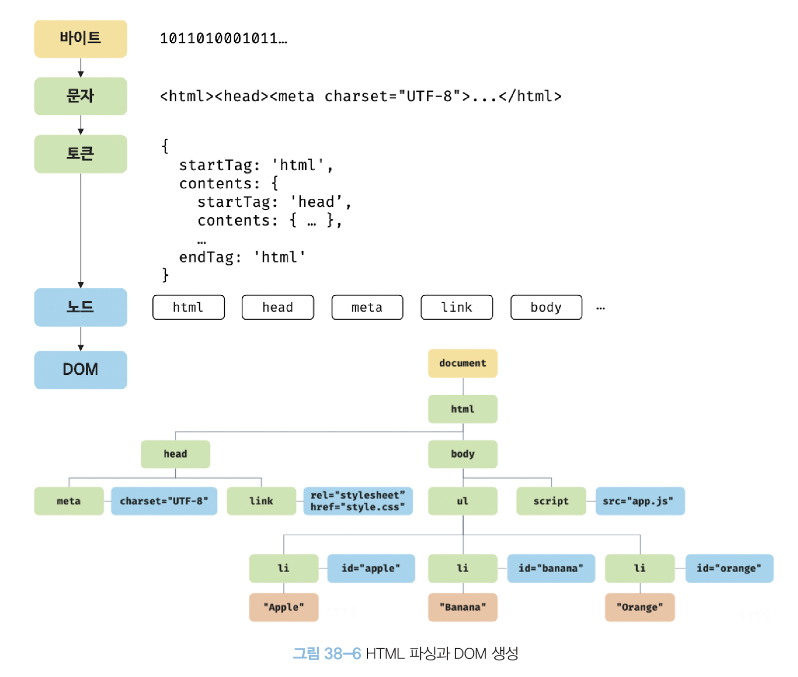
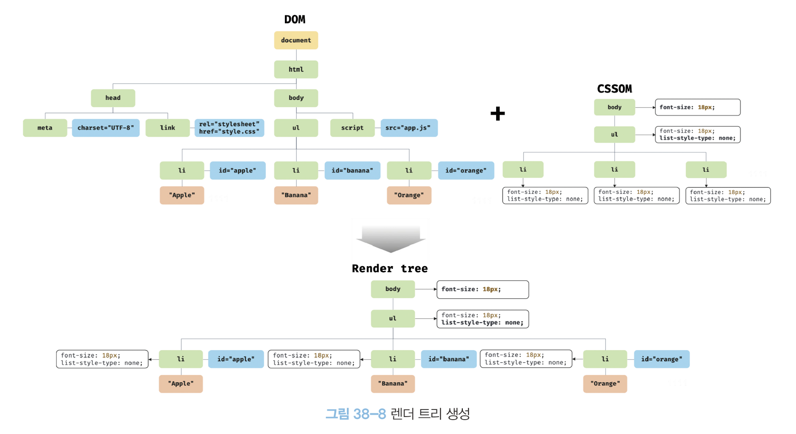
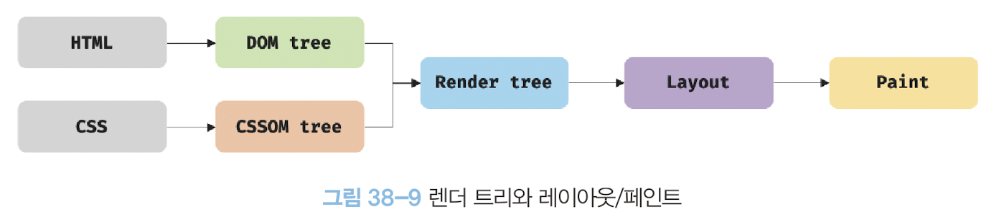
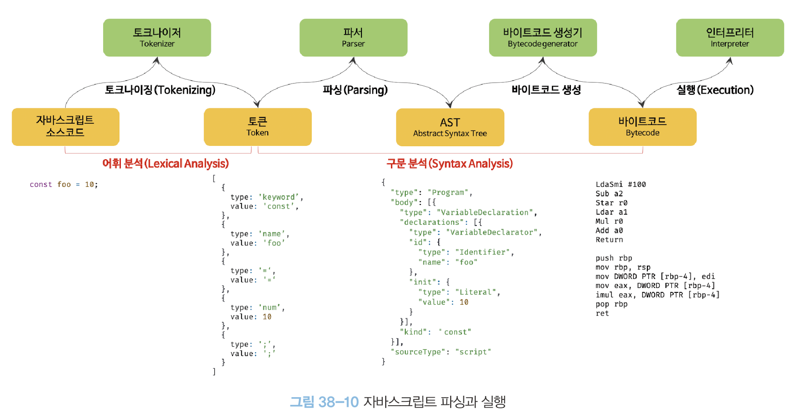

# QnA

### 다음 코드의 결과를 예측해주세요.

```javascript
const map = new Map();
const key1 = { id: 1 };
const key2 = { id: 1 };

map.set(key1, 'value1');
map.set(key2, 'value2');

console.log(map.get(key1));
console.log(map.get(key2));
```

<details>
<summary>정답</summary>

'value1'
'value2'

Map은 객체를 키로 사용할 수 있으며, key1과 key2는 서로 다른 객체이므로 각각 다른 값을 가질 수 있습니다.

</details>

### 브라우저의 렌더링 과정을 순서대로 간단하게 설명해주세요.

<details>
<summary>정답</summary>

1. HTML 파싱과 DOM 생성
2. CSS 파싱과 CSSOM 생성
3. 렌더 트리 생성
4. 레이아웃 계산
5. 페인팅
</details>

### script 태그의 async와 defer의 차이점을 설명해주세요.

<details>
<summary>정답</summary>

- async: HTML 파싱과 JS 파일 로드를 비동기적으로 진행하고, JS 로드가 완료되면 즉시 실행합니다.
- defer: HTML 파싱과 JS 파일 로드를 비동기적으로 진행하지만, DOM 생성이 완료된 후에 JS를 실행합니다.
</details>

# 37장. Set과 Map

# Set

Set 객체는 중복되지 않는 유일한 값들의 집합이며, 수학적 집합의 특성과 일치한다.

| 구분                                 | 배열 | Set객체 |
| ------------------------------------ | ---- | ------- |
| 동일한 값을 중복하여 포함할 수 있다. | O    | X       |
| 요소 순서에 의미가 있다.             | O    | X       |
| 인덱스로 요소에 접근할 수 있다.      | O    | X       |

Set 생성자 함수로 생성하며 이터러블을 인수로 받는다.

### Set 메서드

- 요소 개수 확인: Set.prototype.size
- 요소 추가: Set.prototype.add
- 요소 삭제: Set.prototype.delete
- 요소 존재 여부 확인: Set.prototype.has
- 요소 일괄 삭제: Set.prototype.clear
- 요소 순회: Set.prototype.forEach

# Map

Map 객체는 키와 값의 쌍으로 이루어진 컬렉션이며, 객체와 유사하지만 다음과 같은 차이가 있다.

| 구분                   | 객체                    | Map 객체              |
| ---------------------- | ----------------------- | --------------------- |
| 키로 사용할 수 있는 값 | 문자열 또는 심벌 값     | 객체를 포함한 모든 값 |
| 이터러블               | X                       | O                     |
| 요소 개수 확인         | Object.keys(obj).length | map.size              |

Map 생성자 함수로 생성하며 이터러블을 인수로 받는다.

이때, 인수로 전달되는 이터러블의 요소는 [key, value]로 이루어져 있어야 한다.

### Map 메서드

- 요소 개수 확인: Map.prototype.size
- 요소 추가: Map.prototype.set
- 요소 취득: Map.prototype.get
- 요소 존재 여부 확인: Map.prototype.has
- 요소 삭제: Map.prototype.delete
- 요소 일괄 삭제: Map.prototype.clear
- 요소 순회: Map.prototype.forEach

# 38장. 브라우저의 렌더링 과정

- 파싱(Parsing)
  파싱은 언어 문법에 맞게 작성된 텍스트 문서를 읽어 들여 문자열을 토큰으로 분해하고, 의미와 구조를 반영하여 Parse Tree를 생성하는 일련의 과정
- 렌더링(Rendering)
  HTML, CSS, JS 문서를 파싱하여 브라우저에 시각적으로 출력하는 것



### 렌더링 수행 과정

1. 브라우저는 HTML, CSS, JS, images, fonts 등 리소스를 서버에 요청하여 응답받는다.
2. 브라우저의 렌더링 엔진은 응답된 HTML과 CSS를 파싱하여 DOM과 CSSOM을 생성하고 결합하여 렌더 트리를 생성한다.
3. 브라우저의 자바스크립트 엔진은 응답된 JS를 파싱하여 AST(Abstract Syntax Tree)를 생성하고 바이트코드로 변환하여 실행한다. 이때 JS는 DOM API를 통해 DOM이나 CSSOM을 변경할 수 있으며, 변경 후 다시 렌더 트리로 결합된다.
4. 렌더 트리를 기반으로 HTML 요소의 레이아웃 크기를 계산하고 브라우저 화면에 HTML 요소를 페인팅한다.

### HTML 파싱과 DOM 생성

1. 브라우저가 서버에 html 파일을 요청한다. 서버가 html파일을 읽어 저장된 바이트를 인터넷을 통해 응답한다.
2. 브라우저는 바이트 형태로 받은 html을 meta 태그의 charset 어트리뷰트에 의해 지정된 인코딩 방식(ex: utf-8)을 기준으로 문자열로 변환된다. 이때 meta 태그의 charset 어트리뷰트에 선언된 인코딩 방식은 응답 헤더에 content-type: text/html; charset=utf-8과 같이 담겨 응답된다. 브라우저는 이를 확인하고 문자열로 변환한다.
3. 문자열로 변환된 html 문서를 읽어 문법적 의미를 갖는 코드의 최소 단위인 토큰들로 분해한다.
4. 각 토큰들을 객체로 변환하여 노드를 생성한다. 문서 노드, 요소 노드, 어트리뷰트 노드, 텍스트 노드가 될 수 있으며 이러한 노드는 이후 DOM을 구성하는 기본 요소가 된다.
5. HTML 문서는 HTML 요소들의 집합으로 이루어지며 HTML 요소는 중첩 관계를 갖는다. HTML 요소 관계는 중첩 관계에 의해 부자 관계가 형성되며 이런 모드 노드들을 트리 자료구조로 구성하는데, 이러한 트리 자료구조를 DOM(Document Object Model)이라 한다.



### CSS 파싱과 CSSOM 생성

렌더링 엔진은 HTML을 파싱하며 DOM을 생성해 나가던 중, CSS를 로드하는 link 태그나 style 태그를 만나면 DOM 생성을 일시 중단하고 css파일을 서버에 요청 하여 해당 css를 html과 동일한 파싱 과정(byte → 문자 → 토큰 → 노드 → CSSOM)을 거치며 해석하여 CSSOM을 생성한다. 이후 CSS 파싱을 완료하면 HTML 파싱이 중단된 지점부터 다시 HTML을 파싱하기 시작하여 DOM 생성을 재개한다.

### 렌더 트리 생성

렌더링 엔진은 생성한 DOM과 CSSOM을 결합하여 렌더 트리를 생성한다.

렌더 트리는 렌더링을 위한 트리 구조의 자료구조로, 브라우저 화면에 렌더링되지 않는 노드(ex: meta 태그, script 태그)와 css에 비표시(ex: display: none)되는 노드들은 포함하지 않는다.



완성된 렌더 트리는 각 HTML 요소의 레이아웃(위치와 크기)을 계산하는 데 사용되며 브라우저 화면에 픽셀을 렌더링 하는 `페인팅` 처리에 입력된다.



아래와 같은 경우에 레이아웃 계산과 페인팅을 다시 실행하는 리렌더링 작업이 발생하며, 성능에 악영향을 준다.

- JS에 의한 노드 추가 or 삭제
- 브라우저 창의 리사이징에 의한 뷰포트 크기 변경
- HTML 요소의 레이아웃(위치 ,크기)에 변경을 발생시키는 width/height, margin, padding, border, display, position, top/right/bottom/left 등의 스타일 변경

### 자바스크립트 파싱과 실행

html과 css는 브라우저 렌더링 엔진이 처리하고, JS 파싱과 실행은 JS 엔진이 처리한다.

CSS 파싱과 마찬가지로 렌더링 엔진이 DOM을 생성해나가다가 자바스크립트 파일을 로드하는 script 태그나 컨텐츠로 담은 script 태그를 만나면 DOM 생성을 일시 중지 한다.

그리고 응답받거나 script 태그 내에 있던 JS 코드를 파싱하기 위해 JS 엔진에 제어권을 넘긴다. 파싱과 시행이 끝나면 다시 HTML 파싱을 시작하여 DOM 생성을 재개한다.

JS 엔진은 JS 코드를 파싱하여 CPU가 이해할 수 있는 저수준 언어로 변환하고 실행한다.

자바스크립트를 해석하여 AST(Abstract Syntax Tree)를 생성하고, AST를 기반으로 인터프리터가 실행할 수 있는 중간 코드인 바이트코드를 생성하여 실행한다.



### 리플로우와 리페인트

`리플로우`: 레이아웃 계산을 다시 함. 노드 추가/삭제, 요소의 크기/위치 변경, 윈도우 리사이징 등 레이아웃에 여향을 주는 변경이 발생한 경우에 한하여 실행

`리페인트`: 재결합된 렌더 트리를 기반으로 다시 페인트

레이아웃에 영향이 없는 변경은 리플로우 없이 리페인트만 실행된다.

### script 태그의 적절한 위치와 async/defer 어트리뷰트

DOM이 생성된 이후에 DOM을 조작하는게 적절하므로 body 태그 맨 아래 위치하는게 적절하다.

그렇지 않으면 자바스크립트 파싱에 의한 DOM 생성이 중단될 수 있다.

이를 해결하기 위해 script태그에 `async` 와 `defer` 어트리뷰트가 추가되었다.

- async 어트리뷰트: HTML 파싱과 JS 파일 로드를 비동기적으로 진행하는데, JS 로드가 완료되면 실행시켜 HTML 파싱을 중단한다. 로드가 완료된 순서대로 JS를 실행하기에 순서가 보장되지 않는다.
- defer 어트리뷰트: async와 마찬가지로 비동기적으로 진행하지만 DOM 생성이 완료된 이후에 JS를 실행한다.
