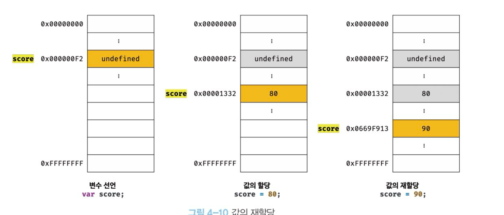
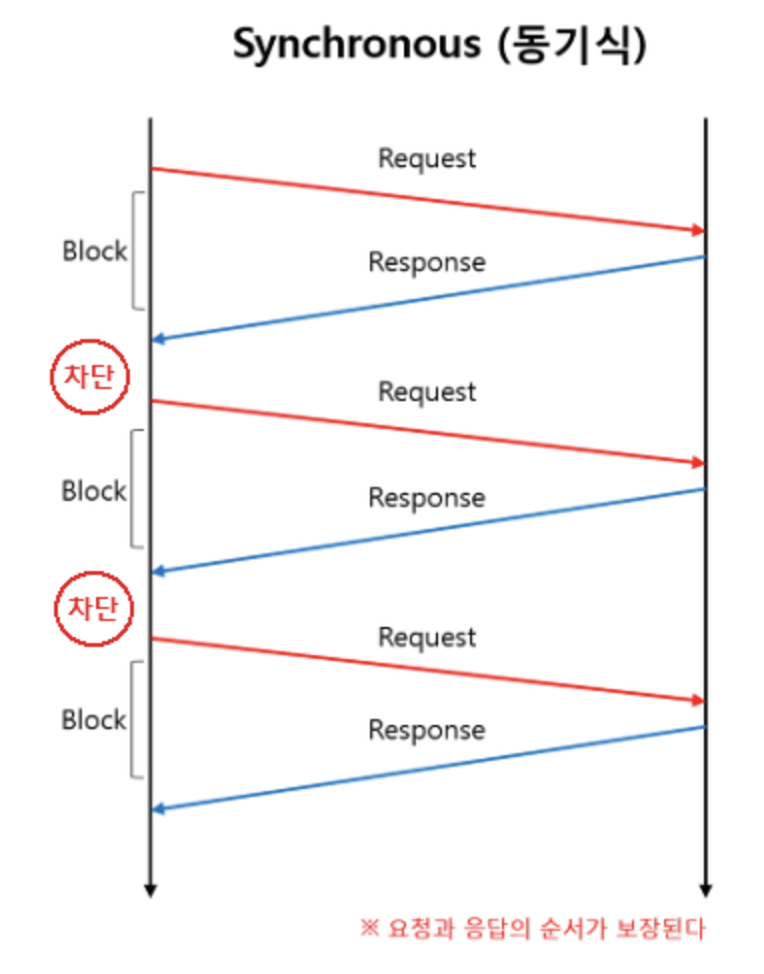
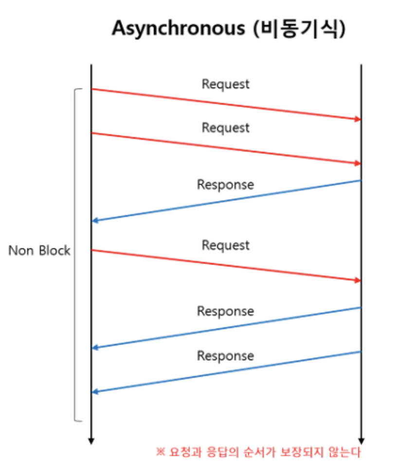

## QnA

---

1. "20" !== 20. (O, X)
<details>
<summary>정답</summary>
    O
</details>

2. 언매니지드 언어가 매니지드 언어에 비해 속도가 빠른 이유를 설명하시오
<details>
<summary>정답</summary>
    
    1. 메모리 관리가 런타임 오버헤드 없이 직접적으로 이루어지기 때문에 런타임 환경에서의 추가 작업 (해석, 가비지 컬렉션)이 없음
    
    2. 하드웨어에 대한 직접 접근과 제어 가능
</details>

3. 

```jsx
console.log(score)

var score = 80;

console.log(score)

console.log(result);

const result = 80;
console.log(result)
```

위 코드의 실행 결과를 순서대로 쓰고 그렇게 생각하는 이유를 설명하시오

<details> 
<summary>정답</summary>
    
    Undefined
    80
    ReferenceError 종료
    
    이유 : 변수 선언의 3단계 선언 단계, 초기화 단계, 할당 단계가 있다.
    **var**은 선언 단계와 초기화 단계가 한 번에 이루어지는 반면에 
    **let, const**는 선언 단계와 초기화 단계가 분리되어 이루어짐
    따라서, 스코프에 변수를 등록 (선언)하지만 초기화 단계는 변수 선언문에 도달했을 때 이루어지므로 **초기화 이전에 변수에 접근**하면 ReferenceError 발생
</details>

---

## 자바스크립트란?

### 자바스크립트의 표준화

- ECMAScript로 명명
- 2015년에 공개된 ECMAScript 6는 let/const 키워드, 함수, 클래스, 모듈 등 기능 도입
- ES6 이후 버전업은 매년 공개할 것으로 예고

### 자바스크립트 성장의 역사

- Ajax
    - JS를 이용해 서버와 브라우저가 **비동기 방식**으로 데이터를 교환할 수 있는 Ajax 등장
    - 서버로부터 필요한 데이터만 전송받아 변경해야 하는 부분만 한정적으로 렌더링 가능 (UI/UX 개선)
- jQuery
    - DOM (웹 문서) 더욱 쉽게 제거
    - 크로스 브라우징 이슈 해결
        - 웹페이지 제작 시 모든 브라우저에서 깨지지 않고 의도대로 올바르게 나오도록 하는 작업
- V8 JS 엔진
    - 구글의 V8 JS 엔진 등장으로 JS는 데스크톱 애플리케이션과 유사한 UX 제공 가능
- Node.js
    - V8 JS 엔진으로 빌드된 JS 런타임 환경
    - 브라우저 이외의 환경에서도 동작할 수 있도록 JS 엔진을 브라우저에서 독립
    - **비동기 I/O** 지원, **단일 스레드** 이벤트 루프 기반으로 동작

### 자바스크립트의 특징

- 웹 브라우저에서 동작하는 유일한 프로그래밍 언어
- 별도의 컴파일 작업 수행 ❌ (인터프리터 언어)


## 변수

### 변수 선언의 실행 시점과 변수 호이스팅

- JS는 인터프리터에 의해 한 줄씩 **순차적**으로 실행

```jsx
console.log(score);

var score;
```

위 코드는 undefined가 출력

→ 변수 선언이 런타임이 아니라 그 이전 단계에서 먼저 실행되기 때문에

**변수 호이스팅**

<aside>
💡

변수 선언문이 코드의 선두로 끌어 올려진 것처럼 동작하는 자바스크립트 고유의 특징

</aside>

### 값의 재할당

- var
    - 재할당 (변수에 저장된 값을 버리고 새로운 값을 저장하는 것) 가능
    - var은 선언과 동시에 undefined로 초기화되기 때문에 처음 할당하는 것도 사실 재할당
- const
    - 재할당 불가

재할당은 새로운 메모리 공간을 확보하고 그 메모리 공간에 값을 저장한다.



위 경우 undefined, 80의 경우 **가비지 콜렉터**에 의해 메모리에서 자동으로 삭제된다.

**가비지 콜렉터**

<aside>
💡

가비지 콜렉터는 애플리케이션이 할당한 메모리 공간을 주기적으로 검사하여 사용되지 않는 메모리를 해제 하는 기능

</aside>

# 1주차 추가 공부 - 동기, 비동기, 블로킹, 논블로킹

# Blocking/Non-Blocking

### Blocking

- 자신의 작업을 진행하다가 다른 주체의 작업이 시작되면 다른 작업이 끝날 때까지 **기다렸다가** 자신의 작업을 시작하는 것
- ex) 직원이 제출한 서류를 Blocking 상사가 다 읽을 때까지 기다렸다가 (아무 일도 ❌) 상사가 서류를 다 읽으면 돌아가서 자기 일을 처리할 수 있게 됨


### Non-Blocking

- 다른 주체의 작업에 **관련없이** 자신의 작업을 하는 것
- ex) 직원이 제출한 서류를 Non-Blocking 상사가 읽음 하지만 Non-Blocking 상사는 본인이 읽어볼테니 그동안 돌아가서 업무를 보라고 말함


<aside>
💡

다른 주체가 작업할 때 자신의 제어권이 있는지 없는지로 볼 수 있다.

</aside>

---

# Synchronous/Asynchronous

### Synchronous

- 동기라는 뜻을 가짐
- 작업을 동시에 수행하거나, 동시에 끝나거나, **끝나는 동시에 시작함**을 의미
- ex) 직원이 Synchronous 상사에게 서류 전달, Synchronous는 직원이 기다리던, 다른 업무를 보던 신경 쓰지 ❌, But 직원은 상사가 보내준 결과를 가지고 빠르게 업무를 처리하고 싶어함, 상사가 결과를 돌려주면 바로 처리함
    
    
    

### Asynchronous

- 비동기라는 뜻을 가짐
- 시작, 종료가 일치하지 ❌, **끝나는 동시에 시작하지 않음**을 의미
- ex) 직원이 Asynchronous 상사에게 서류 전달, Asynchronous 상사는 직원이 기다리던, 다른 업무를 보던 신경 쓰지 ❌, 일을 바로 처리하지 않아도 괜찮아함 상사는 다 읽고 해야 할 일들을 적어놨으니 나중에 확인하라고 하고 보내줌 사원은 내용을 확인하고 언젠가 처리하면 됨
    
    
    

<aside>
💡

결과를 돌려주었을 때, 순서와 결과에 관심이 있는지 아닌지로 판단할 수 있음

</aside>

Ref : https://www.youtube.com/watch?v=oEIoqGd-Sns