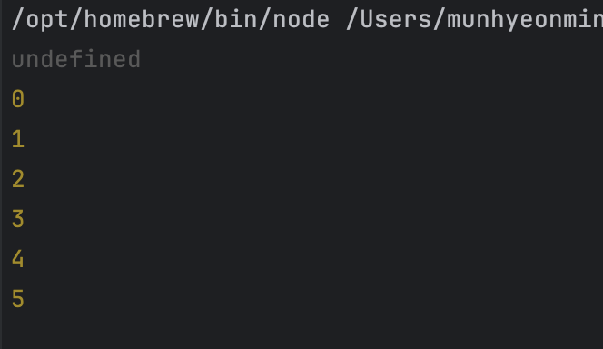

# 연습문제

## 범위: 6장~9장

### 1. 다음의 결과는?

```js
typeof undeclared === "undefined"; // true
undeclared?.x; // ??
```

<details>
<summary>정답</summary>

typeof 연산자는 선언되지 않은 변수도 `undefined`를 반환한다. 하지만 그렇다고 선언되지 않은 변수의 값이 `undefined`라는 뜻은 아니다.
그러므로 `ReferenceError`가 발생한다.

</details>

### 2. 다음의 결과는?

```js
('b'+'a'+ +'a'+'a').toLowerCase(); // 'banana'
('b'+'a'++'a'+'a').toLowerCase(); // ?
```

<details>
<summary>정답</summary>

위 코드의 경우 `+'a'` 부분에서 숫자로의 암묵적 타입 변환이 발생한다. 따라서 `+'a'`가 `NaN`으로 변환되게 된다.
하지만 아래 코드의 경우 `'a'++`, 즉 증감 연산자로 인식되어, `SyntaxError`가 발생한다.

</details>

### 3. `console.log(0.1 + 0.2 === 0.3)`이 `false`인 이유는?

<details>
<summary>정답</summary>

부동소수점 연산때문이다. `0.1`과 `0.2`는 2진수로 표현하면 무한소수이기 때문에 `0.1 + 0.2`는 정확히 `0.3`이 아닌 반올림 된 `0.30000000000000004`을 반환한다.
반면 `0.3`은 별도로 저장된 `0.3`의 근사값이므로 `console.log(0.1 + 0.2 === 0.3)`는 `false`를 반환한다.

</details>

### 4. ==과 ===의 차이에 대해서 설명하시오.

<details>
<summary>정답</summary>
    ==는 두 값이 동등한 지를 뜻합니다. "1" == 1 은 참이 됩니다. ===는 두 값이 일치한 지를 뜻합니다. "1" === 1는 거짓이 되고 1 === 1은 참이 됩니다. ===는 타입체크를 한다는 점에서 보안 유지에 도움이 됩니다.
</details>

### 5. var 변수 타입 사용을 지양하는 이유에 대해 설명하시오.

<details>
<summary>정답</summary>
    1. 같은 이름의 변수로 중복 선언이 가능하다.

```jsx
var url = "https://velog.io/@wksh229";
console.log(url);

/* 아무튼 엄청나게 긴 코드의 여백*/

var url = "https://www.google.com"; // ??
console.log(url);
```

위 코드의 실행 결과를 예측해보자.

url 변수가 2번 선언되어서 에러가 발생할 수도 있지만, 의외로 실행은 잘된다.

**같은 이름의 변수가 2번이나 선언되었음에도 아무런 에러를 일으키지 않고 멀쩡히 작동한다.**

1. 나중에 선언된 변수가 호이스팅으로 인해 사용 가능하다.

```jsx
console.log(fruit);
var fruit = "banana";
console.log(fruit);
```

위와 같이 변수를 선언하면 이전에 학습한 변수 호이스팅된다. 이와 같이 어떤 동작을 일으키는지 예측이 안되기 때문에 사용을 조심해야한다.

1. function scope라 같은 함수 내부에 있다면 선언 위치에 상관 없이 사용이 된다.

```jsx
function novar() {
  console.log(n);
  for (var n = 0; n < 5; n++) {
    console.log(n);
  }
  console.log(n);
}

novar();
```

위 코드를 보면 n은 for문 내부에 선언되어 있으니 for문 밖에서 console.n은 오류가 날 것 같다.

하지만 위 코드를 실행시켜보면



위와 같은 결과를 얻을 수 있다.

undefined까지는 그렇다고 쳐도 5가 출력이 된다.

**이것은 var이 block scope가 아닌, function scope단위 변수이기 때문이다.**

위 코드에서 n은 그나마 novar 함수 안에서 선언된 함수이다. 다른 경우를 살펴보자.

```jsx
for (var i = 0; i < 5; i++) {
  console.log(i);
}
```

위와 같이 전역에 var을 선언해놓으면 var은 전역변수가 된다. i는 이제 프로그램이 종료되기 전까지 살아있게 된다.

```jsx
for (var i = 0; i < 5; i++) {
  console.log(i);
}

function func1() {
  i++;
}
```

만약 추가로 이런 함수가 작성된다면 결과를 예측하기 더욱 어려워지게 된다.

**그래서 쓰지말라고 합니다**

</details>

### 6. .forEach 루프와 .map() 루프의 주요 차이점을 설명하시오. 둘 중 하나를 선택해야 하는 상황이 온다면 어떤 상황에 어떤 루프를 선택할건가요?

<details>
<summary>정답</summary>
    일단 forEach와 map이 어떤 일을 하는지 알아보자.

📌 forEach

- 배열의 요소를 반복한다.
- 각 요소에 대해 콜백을 실행한다.
- 값을 반환하지 않는다.

  ```jsx
  const a = [1, 2, 3];
  const doubled = a.forEach((num, index) => {
    // num나 index로 무언가 합니다.
  });

  // doubled = undefined
  ```

📌 map

- 배열의 요소를 반복한다.
- 각 요소에서 함수를 호출하여 결과로 새 배열을 작성하여 각 요소를 새 요소에 매핑한다.

  ````jsx
  const a = [1, 2, 3];
  const doubled = a.map((num) => {
  return num \* 2;
  });

      // doubled = [2, 4, 6]
      ```

      forEach와 map의 가장 큰 차이점은 **map이 새로운 배열을 반환**한다는 것이다.

      결과가 필요하지만 원본 배열을 변경하고 싶지않으면 map()을 사용하고, 단순히 배열을 반복할 필요가 있다면 forEach를 선택하는 것이 좋다.


  ````

  </details>

### 7. 타입스크립트에서 덕 타이핑(Duck Typing)이란 무엇일까? 왜 타입스크립트는 덕 타이핑일까

### 8. 데이터 타입은 왜 필요할까?

### 9. null과 undefined의 차이?

### 10. Symbol 타입은 다른 언어에서 볼 수 없는 타입인데 어떤 이유로 존재하는가

<details>
<summary>정답</summary>

- 객체의 프로퍼티 키로 사용

  ```javascript
  const id = Symbol("id");
  const user = {
    name: "Alice",
    [id]: 12345, // 심벌을 키로 사용
  };
  ```

  - Symbol('id')로 생성된 키는 다른 곳에서 동일한 이름으로 심벌을 생성해도 충돌하지 않음.
  - ```javascript
    s_id1 = Symbol("id");
    s_id2 = Symbol("id");

    obj = {
      [s_id1]: "first Symbol",
      [s_id2]: "second Symbol",
    };

    console.log(obj);
    ```

  - 심벌 키는 for...in이나 Object.keys()에서 열거되지 않음 - Object.getOwnPropertySymbols()를 통해 Symbol만 열거 가능
  </details>
  </details>

### 11. null과 undefined의 차이는 무엇일까

<details>
<summary>정답</summary>

`null`

- 값이 없음을 의도적으로 명시할 때 사용합니다.
- 변수나 객체가 의도적으로 비어 있음을 나타내고 싶을 때 null을 할당.
- null은 명시적으로 값이 없음을 나타내는 값으로, object 타입으로 분류됨.
- JavaScript의 초기 설계상의 버그로 인해 타입이 object로 표시되지만, 실제로는 아무 값도 참조하지 않는 상태.

`undefined`

- JavaScript 엔진이 변수를 선언만 하고 초기화하지 않았을 때 자동으로 할당하는 값입니다.
- 개발자가 명시적으로 사용하는 것은 권장되지 않음

| 구분            | 메모리 값                            | 설명                                   |
| --------------- | ------------------------------------ | -------------------------------------- |
| **`null`**      | Null pointer (`0x00000000`)          | 메모리 상에서 비어 있는 참조를 가리킴. |
| **`undefined`** | Undefined constant (`0x00000001` 등) | JavaScript 엔진이 정의한 고유한 값.    |

</details>

### 12. 문자열은 왜 변경 불가능하게 설정될까

<details>
<summary>정답</summary>
문자열이 여러 변수에서 참조 될 때, 메모리 효율을 높이고, 값 변경으로 인한 부작용을 방지하기 위함
</details>

### 13. 데이터 타입을 통해 메모리 공간을 확보하고 참조하고 값을 해석할 수 있다. 그렇다면 해당 변수가 어떤 데이터 타입인지에 대한 정보는 어디에서 찾을 수 있는가?

<details>
<summary>정답</summary>

JavaScript는 동적 타입 언어라 변수에 저장된 값의 타입은 런타임에 결정된다. 따라서 다른 언어처럼 int와 같은 자료형으로 확인할 수 있는게 아니다.
자바스크립트 엔진마다 방식이 다르지만, 대표적인 V8에서는 변수에 저장된 값의 타입을 식별하기 위해 별도의 메타 데이터를 같이 저장한다.
이를 타입 태그(Type Tag)라고 하며, 아래와 같은 태그 비트를 저장한다.

```
[ 000...00010 ] -> "태그 비트 10: 숫자"
[ 000...00100 ] -> "태그 비트 100: 문자열"
```

</details>

### 14. 자바스크립트의 Object.is()와 일치 비교 연산자(===)의 차이점을 설명하고, 아래 코드의 실행 결과를 예측하시오.

```javascript
console.log(Object.is(NaN, NaN)); // ???
console.log(NaN === NaN); // ???
console.log(Object.is(+0, -0)); // ???
console.log(+0 === -0); // ???
console.log(Object.is(null, null)); // ???
console.log(null === null); // ???
```

<details>
<summary>정답</summary>

1. NaN의 비교
   - Object.is(NaN, NaN) → true
   - NaN === NaN → false
2. +0과 -0의 비교

   - Object.is(+0, -0) → false
   - +0 === -0 → true

3. null의 비교
   - Object.is(null, null) → true
   - null === null → true

따라서 코드의 실행 결과는:

```javascript
console.log(Object.is(NaN, NaN)); // true
console.log(NaN === NaN); // false
console.log(Object.is(+0, -0)); // false
console.log(+0 === -0); // true
console.log(Object.is(null, null)); // true
console.log(null === null); // true
```

</details>

### 15. 다음 코드의 실행 결과를 예측하고, 그 이유를 설명하시오.

```javascript
console.log([] == ![]); // ???
console.log([] == false); // ???
console.log(![] == false); // ???
```

<details>
<summary>정답</summary>

1. `[] == ![]`

   - ![]는 false가 됨 (빈 배열은 truthy이므로 ![]는 false)
   - [] == false 비교로 변환
   - []는 숫자로 변환 시 0
   - false는 숫자로 변환 시 0
   - 0 == 0 이므로 true

2. `[] == false`

   - []는 숫자로 변환 시 0
   - false는 숫자로 변환 시 0
   - 0 == 0 이므로 true

3. `![] == false`
   - ![]는 false (빈 배열은 truthy)
   - false == false 이므로 true

</details>
