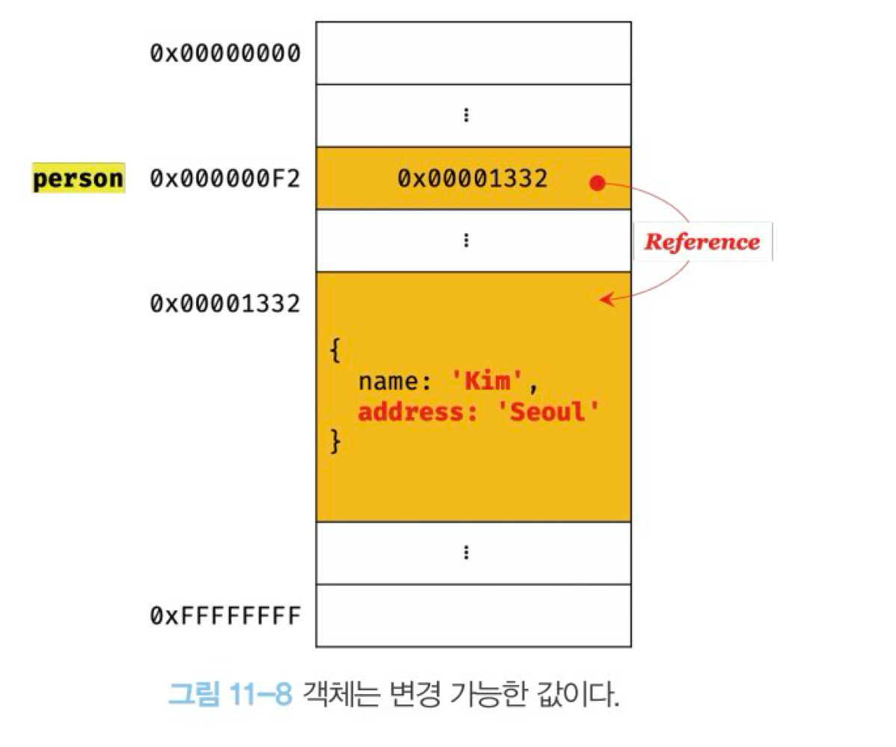
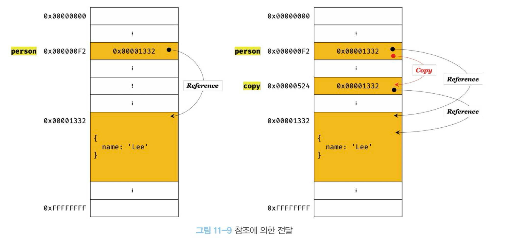

# QnA

### 아래의 결과를 예상해보자.

```
var foo = function add(x, y) {
  return x + y;
}

console.log(foo(1, 2)); // ?
console.log(add(1, 2)); // ?
```

<details>
<summary>정답</summary>

```
console.log(foo(1, 2)); // 3
console.log(add(1, 2)); // ReferenceError: add is not defined
```

함수 이름은 본래 함수 몸체에서만 사용이 가능한 식별자다.
일반적으로는 함수 선언문을 이용해 함수 객체를 생성하는데, 자바스크립트 엔진이 암묵적으로 함수 이름에 맞는 식별자를 생성해주므로 외부에서 함수 이름을 통해 참조할 수 있다.

</details>

### 아래의 결과를 예상해보자.

```
console.log(add(2, 3)); // ?
console.log(sub(2, 3)); // ?

function add(x, y) {
  return x + y;
}

var sub = function(x, y) {
  return x - y;
};
```

<details>
<summary>정답</summary>

```
console.log(add(2, 3)); // 5
console.log(sub(2, 3)); // TypeError: sub is not a function
```

함수 선언문으로 작성된 함수는 컴파일 단계에서 함수 객체가 생성되지만,
함수 표현식으로 작성된 함수는 런타임에서 함수 객체가 생성되고, sub라는 변수는 var를 이용해 선언되었으므로
함수 호이스팅에 의해 undefined로 초기화된다.
undefined는 function이 아니기 때문에 TypeError가 발생한다.

</details>

### 아래의 결과를 예상해보자.

```
// 테스트 1
function foo() {
  var a = 3;
  var b = 5;
  return a * b;
}();

// 테스트 2
(function bar() {
  var a = 3;
  var b = 5;
  return a * b;
}());
```

<details>
<summary>정답</summary>

```
// SyntaxError: Unexpected token (
// 15
```

테스트 1의 경우 function ~ {} 까지는 undefined로 평가된다. 따라서 ()를 통해 함수를 호출하려고 하면 SyntaxError가 발생한다.
테스트 2의 경우는 즉시 실행 연산자 `()`를 통해 함수 객체를 생성하고 바로 실행되므로 올바른 결과가 나타난다.

</details>

# 10장. 객체 리터럴

## 객체란?

원시값은 변경이 불가능(immutable)한 값이지만, 객체는 변경이 가능(mutable)하다.

객체는 0개 이상의 프로퍼티로 구성된 값이며, 프로퍼티는 프로퍼티 키와 값으로 구성된다.

```tsx
var person = {
  name: 'Lee', // key - name / value - 'Lee'
  age: 20, // key - age / value - 20
};
```

자바스크립트에서는 함수가 일급객체이므로 프로퍼티의 값으로 함수가 올 수 있다.

```tsx
var counter = {
  count: 0, // 프로퍼티
  increase: function () {
    // 함수인 프로퍼티. 즉, 메서드
    this.count++;
  },
};
```

## 객체 리터럴에 의한 객체 생성

다른 언어에서는 클래스를 만들고 생성자를 통해 객체(인스턴스)를 생성하지만, 자바스크립트에서는 객체 리터럴을 사용하여 단순하게 객체를 생성할 수 있다. 이외의 방법으로는 모두 함수를 사용해야한다.

객체 리터럴은 코드 블록과 다르다는 점에 주의하자. 객체 리터럴 뒤에는 세미콜론(;)이 붙어야 한다.

## 프로퍼티

규칙

- 프로퍼티 키: 문자열 사용(혹은 심벌값)
- 프로퍼티 값: 자바스크립트에서 사용 가능한 모든 값

식별자 네이밍 규칙을 지킬 경우 따옴표가 필요없지만, 그렇지 않을 경우 반드시 따옴표를 포함해야한다.

프로퍼티 키를 동적으로 대입할 수 있으며, 이때 대괄호([])을 사용한다.

빈 문자열도 프로퍼티 키로 사용 가능하지만 의미를 지니지 못해 추천하지 않는다.

키에 문자열이나 심벌값이 아닌 다른 값을 대입하는 경우 문자열로 암묵적 타입 변환이 일어난다.

```tsx
let propertyKey = 'age';

var person = {
  firstName: 'SeungYeop',
  'last-name': 'Hyun',
  [propertyKey]: 26,
};
```

## 프로퍼티 접근

프로퍼티는 아래 두가지 방식으로 접근이 가능하다.

- 마침표 표기법 `.`
- 대괄호 표기법 `[]`

존재하지 않는 프로퍼티에 접근하면 undefined를 반한환다.

아래 예시를 보며 바로 확인하자.

```tsx
var person = {
	'last-name': 'Hyun',
	firstName: 'SeungYeop',
	1: 10
};

person.firstName; // 'Seungyeop'
person.'last-name'; // 'Hyun'
person.last-name; // Browser -> NaN / Node.js -> Reference Error: name is not defined

person[last-name]; // Reference Error: last is not defined
person['last-name']; // 'Hyun'

person.1; // SyntaxError: Unexpected number
person.'1'; // SyntaxError: Unexpected string
person[1]; // 10
person['1']; // 10

```

## 프로퍼티 값 갱신 / 생성 / 삭제

- **갱신**: 이미 존재하는 프로퍼티에 값을 할당
- **생성**: 존재하지 않는 프로퍼티에 값을 할당
- **삭제**: `delete` 연산자를 이용하여 삭제한다. 프로퍼티가 존재하지 않아도 에러가 발생하지 않는다.

```tsx
var person = {
  age: 1,
};

person.age = 2; // 값 갱신
person.lastName = 'Hyun'; // 값 생성
delete person.age; // 값 삭제
```

### ES6에 추가된 객체 리터럴 확장 기능

### 프로퍼티 축약 표현

프로퍼티 값으로 변수를 사용할 때, 키와 변수명이 같을 경우 프로퍼티 키를 생략할 수 있다.

```tsx
let x = 1;

const obj = { x }; // { x: x }
```

### 계산된 프로퍼티 이름

문자열로 변환할 수 있는 값으로 프로퍼티 키를 동적으로 생성하려고 할 때, 기존에는 외부에서 할당해야했지만 ES6부터는 바로 할 수 있다.

```tsx
// ES5
var prefix = 'prop';
var obj = {};
var i = 0;

obj['prefix' + '-' + i] = 1;

// ES6
const prefix = 'prop';
let i = 0;

const obj = { [`${prefix}-${i}`] };
```

### 메서드 축약 표현

메서드를 선언할 때 function키워드를 사용하지 않아도 된다.

하지만 프로퍼티에 할당한 함수와 다르게 동작한다.

```tsx
// ES5
var obj = {
  sayHi: function () {
    console.log('hi');
  },
};

// ES6
const obj = {
  sayHi() {
    console.log('hi');
  },
};
```

# 11장. 원시 값과 객체의 비교

- 원시값은 변경이 불가능한 값 `immutable`, 객체는 변경이 가능한 값 `mutable`
- 원시값에 값을 할당하면 변수(확보된 메모리 공간)에 실제 값이 저장되고, 객체에 값을 할당하면 변수에 객체의 참조값이 저장된다.
- 원시값이 할당된 변수를 이용해 다른 변수에 할당하면 원시값이 복사가 되어 저장이 된다. `pass by value` 객체값이 할당된 변수를 이용해 다른 변수에 할당하면 객체의 주소값이 그대로 전달된다. `pass by reference`

### 원시값은 변경 불가능하다

변수의 값을 바꿀 수 있다는 것이 아니라, 해당 변수에 할당된 값을 변경하지 못한다는 말이다.

변수에 새로운 값을 할당한 경우, 이미 확보된 메모리 공간의 값을 변경하는 것이 아니라 새로운 메모리 공간에 해당 값을 할당하고 변수가 새로운 메모리 공간을 참조하게 하는 것이다.


### 문자열도 원시값이다

문자열은 한 글자당 2바이트씩을 가지며 글자 수에 따라 확보하는 메모리 공간의 크기가 다르다.

문자열은 유사 배열 객체이므로 `length` 프로퍼티를 가지고 `str[1]`과 같이 특정 인덱스를 참조할 수 있지만 원소 하나 값 변경도 불가능하다.

```tsx
var str = 'Hello';
str = 'World!';

str; // 'World!'

str[1] = 'S';
str; // 'World!'
```

### 값에 의한 전달

```tsx
var data = 100;
var copy = data;

data = 80;

console.log(data, copy); // 80 100
```

위처럼 원시값을 변수에 할당하고, 값을 재할당하는 경우를 살펴보자.

사실 값에 의한 전달이라는 말이 엄밀하게 말하면 아니라고 할 수 있다.

변수는 사실 값 자체를 가지고 있는 것이 아닌, 값을 참조할 수 있는 실제 메모리 주소를 가지고 있다.

data라는 변수에는 100이라는 값으로 채워진 메모리 공간의 주소를 가지고 있는 것이다.

2번째 라인에서 동작과정은 실제 자바스크립트 엔진의 구현방식에 따라 다를 수 있다.

`var copy = data` 를 실행할 때, 100이라는 값을 가진 새로운 메모리 주소 공간을 확보하여 그 주소를 copy에 전달할 수도 있고, 아니면 data와 동일한 메모리 주소를 전달할 수도 있다. (파이썬은 후자와 같은 방식으로 동작한다.)

하지만 `data = 80` 과 같이 값이 새롭게 할당된 경우에는 data와 copy는 다른 메모리 주소를 가지게 됨은 분명하다.

## 객체

객체는 프로퍼티 개수가 정해져있지 않아 메모리 공간 크기를 사전에 정할 수 없다.

자바스크립트 내부 엔진에서는 해시 테이블과 비슷하게 객체를 관리하는데, V8엔진에서는 히든 클래스라는 방식으로 객체 프로퍼티에 접근하는 데에 있어 성능을 보장한다.




변수에 객체를 저장하면 해당 변수에 저장된 메모리 주소를 통해 참조값을 얻을 수 있다.

객체에 프로퍼티를 추가할 때마다 새롭게 객체를 생성하고 할당하면 비효율적이다.

따라서 참조값을 통해 변경 가능한 값으로 설정되었다.

### 참조에 의한 전달



```tsx
var person = {
  name: 'Lee',
};

var copy = person; // 참조 값을 복사(얕은 복사)
```

사실 `값에 의한 전달` 이나 `참조에 의한 전달` 둘 다 식별자가 기억하는 메모리 주소 공간의 값을 전달한다는 점은 동일하다. 하지만 해당 값이 원시 값이냐 참조 값이냐에 따라 구분될 뿐이다.

엄밀히 말하자면 둘 다 값에 의한 전달이나 마찬가지다.

# 12장. 함수

## 함수 리터럴

자바스크립트의 함수는 객체 타입의 값이다. 하지만 일반 객체와는 다르게 호출할 수 있다.

함수는 객체이기 때문에 함수 리터럴을 이용하여 변수에 할당할 수 있다.

```tsx
var f = function add(x, y) {
  return x + y;
};
```

## 함수 정의

함수 선언문과 함수 표현식은 다르다. 아래 코드를 살펴보자.

```tsx
// 함수 선언문
function foo() {
  console.log('foo');
}

foo(); // 'foo'

// 함수 표현식
(function bar() {
  console.log('bar');
});
bar(); // ReferenceError: bar is not defined
```

foo() 처럼 피연산자로 사용되지 않은 경우에는 함수 선언문으로, bar()처럼 피연산자로 사용된 경우에는 함수 표현식으로 평가가 된다.

그렇다면 foo는 왜 호출이 가능하고 bar를 호출하려고 하면 참조 오류가 왜 나타나는 지 아래 그림을 살펴보자.


**우선 함수 이름은 함수 몸체에서만 사용할 수 있는 값이다.**

그렇기 때문에 bar같은 경우 외부에서 함수를 가리키는 식별자가 없으므로 사용할 수 없다.

하지만 함수 선언문을 통해 생성된 함수 객체 같은 경우에는 자바스크립트 엔진이 해당 함수이름을 보고 암묵적을오 식별자를 생성해준다.

의사코드를 작성해보자면 아래와 같다.

```tsx
var foo = function foo() {
  console.log('foo');
};
```

함수는 값으로도 사용될 수 있는 `일급객체`다.

함수 표현식을 통해 변수에 할당할 경우, 보통 익명 함수로 작성한다.

```tsx
// 아래와 같은 상황을 방지한다. 기명 함수 표현식을 이용해 변수에 함수를 할당해보자.
var add = function foo(x, y) {
  return x + y;
};

// 함수 객체를 가리키는 식별자로 호출
console.log(add(2, 5)); // 7

// 함수 이름은 함수 몸체 내부에서만 유효한 식별자다!
console.log(foo(2, 5)); // ReferenceError: foo is not defined
```

두 차이를 정리해보면 다음과 같다.

- 함수 선언문 → 표현식이 아닌 문
- 함수 표현식 → 표현식인 문

### 함수 생성 시점과 함수 호이스팅

```tsx
// 함수 참조
console.log(add); // f add(x, y)
console.log(sub); // undefined

// 함수 호출
console.log(add(2, 5)); // 7
console.log(sub(2, 5)); // TypeError: sub is not a function

// 함수 선언문
function add(x, y) {
  return x + y;
}

// 함수 표현식
var sub = function (x, y) {
  return x - y;
};
```

함수 선언문과 함수 표현식을 사용할 때의 함수 생성 시점은 다르다.

함수 선언문을 사용하면 런타임 이전에 함수 객체가 생성되고, 함수 표현식을 사용하면 변수 호이스팅과 동일하게 선언은 되지만 그와 동시에 undefined로 초기화된다.

함수 표현식을 이용하면 함수 객체는 런타임에 생성된다.


## 함수 호출

함수 호출할 때 인수가 매개변수보다 많으면 무시하고, 적어서 할당되지 않은 매개변수는 undefined를 가진다.

완전히 무시되진 않고, 암묵적으로 arguments 객체의 프로퍼티에 보관된다.

## 다양한 함수의 형태

### 즉시 실행 함수

```tsx
(function () {
  var a = 3;
  var b = 5;
  return a * b;
})();
```

즉시 실행 연산자는 반드시 `그룹 연산자(...)`로 감싸야 한다.

### 중첩 함수

```tsx
function outer() {
  var x = 1;

  // 중첩 함수
  function inner() {
    var y = 2;
    console.log(x + y); // 3
  }
}

outer();
```

### 콜백 함수

```tsx
// 매개변수를 통해 콜백 함수를 전달받은 함수를 '고차 함수'라고 한다.
function repeat(n, func) {
  for (var i = 0; i < n; i++) {
    func(i);
  }
}
```
