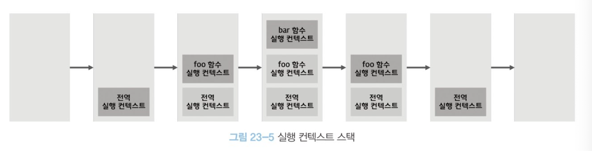
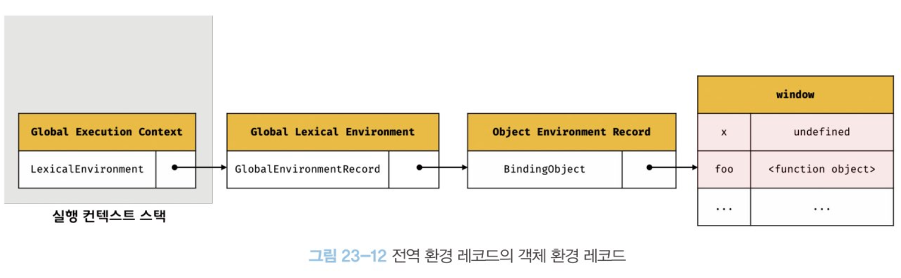

# QnA

### 실행 중인 실행 컨텍스트는 무엇인가요?

<details>
<summary>정답</summary>

스택의 최상위에 존재하는 실행 컨텍스트를 말합니다.
스택의 최상위 실행 컨텍스트는 언제나 현재 실행 중인 코드의 실행 컨텍스트이기 때문입니다.

</details>

### 함수의 실행이 끝나, 실행 컨텍스트 스택에서 함수 실행 컨텍스트가 제거된 이후, 함수의 렉시컬 환경은 어떻게 될까요?

<details>
<summary>정답</summary>

렉시컬 환경은 독립적인 객체이므로, 누군가에 의해 참조되지 않을 때 가비지 컬렉터에 의해 삭제된다.
따라서 실행 컨텍스트가 제거된 이후에도 함수의 렉시컬 환경을 누군가 참조하고 있다면 렉시컬 환경은 소멸되지 않는다.

</details>

### outer 함수의 렉시컬 환경은 실행이 끝난 뒤 소멸되나요?

```js
const x = 1;

function outer() {
  const x = 10;
  const inner = function () {
    console.log(x);
  };
  return inner;
}

const innerFunc = outer();
innerFunc(); // 10
```

<details>
<summary>정답</summary>

아닙니다.

outer 함수의 렉시컬 환경은 inner 함수에 의해 참조되고 있기 때문에 가비지 컬렉션의 대상이 아닙니다.

</details>

# 공부

## 실행 컨텍스트

> 실행 컨텍스트는 소스코드를 실행하는데 필요한 환경을 제공하고 코드의 실행 결과를 실제로 관리하는 영역
> 식별자를 등록하고 관리하는 스코프와 코드 실행 순서 관리를 구현한 내부 메커니즘
> 모든 코드는 실행 컨텍스트를 통해 실행되고 관리됨

- 식별자와 스코프는 실행 컨텍스트의 렉시컬 환경으로 관리
- 코드 실행 순서는 실행 컨텍스트 스택으로 관리

### 소스코드의 타입

- 전역 코드
- 함수 코드
- eval 코드
- 모듈 코드

### 소스코드의 평가와 실행

- 소스코드의 평가
  - 실행 컨텍스트를 생성하고 변수, 함수 등의 선언문을 실행하여 실행 컨텍스트가 관리하는 스코프에 등록
- 소스코드의 실행
  - 소스코드를 순차적으로 실행 (런타임)

### 실행 컨텍스트 스택



- 실행 컨텍스트 스택은 코드의 실행 순서를 관리.
- 스택의 최상위에 존재하는 실행 컨텍스트는 언제나 현재 실행 중인 코드의 실행 컨텍스트 (실행 중인 실행 컨텍스트)

### 렉시컬 환경


- 식별자와 식별자에 바인딩 된 값, 상위 스코프에 대한 참조를 기록하는 **자료구조**
- 실행 컨텍스트를 구성하는 컴포넌트

**렉시컬 환경의 구성**

- 환경 레코드
  스코프에 포함된 식별자와 그 값을 관리하는 저장소
- 외부 렉시컬 환경에 대한 참조
  상위 스코프를 가르킴

### 전역 렉시컬 환경

- 전역 실행 컨텍스트에 속한 렉시컬 환경

**전역 환경 레코드**

- 전역 환경 레코드는 var와 let, const를 구분하여 관리하기 위해 **객체 환경 레코드**와 **선언적 환경 레코드**로 구성되어 있음
  - 객체 환경 레코드
    - var 키워드로 선언된 전역 변수, 표준 빌트인 객체와 같은 값
    - BindingObject라고 부르는 객체와 연결됨.
    - BindingObject를 통해 전역 변수와 전역 함수를 전역 객체의 프로퍼티와 메서드로 등록함. 따라서 식별자를 객체 환경 레코드에서 검색하면 전역 객체의 프로퍼티를 검색하여 반환함.
      
    - **객체 환경레코드는 BindingObject를 통해 전역 객체와 연결되기 때문에 var로 선언한 변수, 함수 선언문으로 정의한 함수는 즉시 전역 객체에 할당됨. 이로인해 호이스팅이 발생함**
  - 선언적 환경 레코드
    - let, const 키워드로 선언한 전역 변수
    - 전역 객체와 연결되어 있지 않기 때문에 let, const로 선언한 전역 변수는 전역 객체의 프로퍼티가 되지 않음.
      
    - 즉 변수 선언과 초기화 단계가 분리되어 진행되기 때문에 런타임 중 변수 선언문에 도달하기 전까지 TDZ에 빠지게 된다.

### 식별자 결정

- 코드 실행 도중, 변수 할당문 또는 함수 호출문을 실행하기 위해 어떤 식별자를 참조할 지 결정하는 것을 의미함
- 현재 실행 중인 실행 컨텍스트에서 식별자를 검색할 수 없다면 외부 렉시컬 환경의 참조, 즉 상위 스코프로 이동하여 식별자를 검색함. 이것이 바로 스코프 체인의 동작 원리임.

### 함수의 외부 렉시컬 환경에 대한 참조 결정

- 외부 렉시컬 환경에 대한 참조는 **함수 정의가 평가된 시점에 실행 중인 실행 컨텍스트의 렉시컬 환경의 참조**로 할당된다.
- 함수를 어디서 호출했는지가 아니라 어디서 정의했는 지에 따라 상위 스코프를 결정하는 **렉시컬 스코프**가 여기서 비롯되는 것이다.

### 블록 레벨 스코프

- 블록 레벨 스코프를 생성하는 모든 블록문은 코드블록이 생성될 때마다 새로운 렉시컬 환경을 생성한다.

## 클로저

> 함수와 그 함수가 선언된 렉시컬 환경과의 조합

### 함수 객체의 내부 슬롯 [[Environment]]

- 함수 객체가 생성될 때, 현재 실행 중인 실행 컨텍스트의 렉시컬 환경을 `[[Environment]]`에 저장한다.  
  함수 객체를 생성하는 시점에서 실행 중인 실행 컨텍스트는 해당 함수의 상위 실행 컨텍스트이기 때문이다.
- 함수 렉시컬 환경의 "외부 렉시컬 환경에 대한 참조"에는 함수 객체 내부 슬롯 `[[Environment]]`에 저장된 렉시컬 환경의 참조가 할당된다.

### 클로저

> 이미 생명 주기가 종료한 외부 함수의 변수를 참조하는 중첩 함수. 즉, 자신의 상위 스코프 함수의 렉시컬 환경을 기억하고 있는 함수를 클로저라고 부른다.

```js
const x = 1;

function outer() {
  const x = 10;
  const inner = function () {
    console.log(x);
  };
  return inner;
}

const innerFunc = outer();
innerFunc(); // 10
```

> inner함수가 생성될 때의 실행 컨텍스트(outer 함수의 실행 컨텍스트)가 inner 함수의 `[[Environment]]` 내부슬롯에 저장된다. 따라서 함수를 어디서 호출하든 inner 함수는 자신의 상위 스코프 outer 함수를 기억한다.

- outer 함수의 실행이 끝나 outer 함수의 실행 컨텍스트가 실행 컨텍스트 스택에서 제거되어도 outer 함수의 렉시컬 환경은 소멸되지 않는다. \* 렉시컬 환경은 독립적인 객체이기 때문
- outer 함수의 렉시컬 환경은 inner 함수의 `[[Environment]]` 내부 슬롯에 의해 참조되고 있기 때문에 가비지 컬렉션의 대상이 아니다.

```js
function foo() {
  const x = 1;

  function bar() {
    const z = 3;
    console.log(z);
  }

  return bar;
}

const bar = foo();
bar();
```

- `bar`함수처럼 상위 스코프의 어떤 식별자도 참조하지 않는다면 대부분의 모던 브라우저는 상위 스코프를 기억하지 않는다. 이 경우, 해당 함수는 클로저라고 부를 수 없다.

```js
function foo() {
  const x = 1;

  function bar() {
    console.log(x);
  }
  bar();
}

foo();
```

- bar의 경우 상위 스코프의 식별자를 참고하고 있다. 다만 외부함수 foo보다 생명 주기가 짧기 때문에, 생명 주기가 종료된 외부 함수의 식별자를 참조할 수 있다는 클로저의 본질에 부합하지 않는다. 이 경우도 일반적으로 클로저라고 하지 않는다.

### 클로저의 활용

```js
const increase = (function () {
  let num = 0;

  return function () {
    return ++num;
  };
})();

console.log(increase()); // 1
console.log(increase()); // 2
console.log(increase()); // 3
```

- 즉시 실행 함수가 반환한 함수가 increase 변수에 할당됨. 이 함수는 즉시 실행 함수의 렉시컬 환경을 기억하는 클로저이다.
- num은 오직 increase에 의해서만 접근 가능하다.
